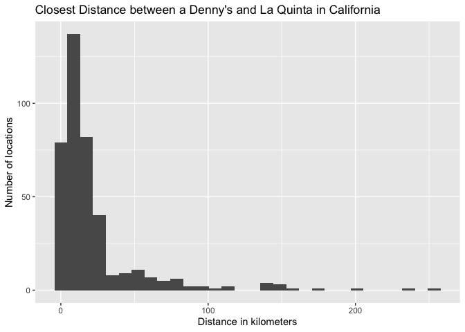

Lab 05 - Wrangling spatial data
================
Heather Hawkins
02/08/23

### Load packages and data

``` r
library(tidyverse) 
library(dsbox) 
```

``` r
states <- read_csv("data/states.csv")
```

### Exercise 1

``` r
dn_ak <- dennys %>%
  filter(state == "AK")
nrow(dn_ak)
```

    ## [1] 3

There are only 3 dennys in Alaska

### Exercise 2

``` r
lq_ak <- laquinta %>%
  filter(state == "AK")
nrow(lq_ak)
```

    ## [1] 2

There are only 2 La Quintas in Alaska

### Exercise 3

There are 6 pairing b/w all Denny’s and La Quinta locations in Alasaka,
so we will have to calculate 6 distances.

``` r
dn_lq_ak <- full_join(dn_ak, lq_ak, by = "state")
```

    ## Warning in full_join(dn_ak, lq_ak, by = "state"): Each row in `x` is expected to match at most 1 row in `y`.
    ## ℹ Row 1 of `x` matches multiple rows.
    ## ℹ If multiple matches are expected, set `multiple = "all"` to silence this
    ##   warning.

``` r
dn_lq_ak
```

    ## # A tibble: 6 × 11
    ##   address.x      city.x state zip.x longi…¹ latit…² addre…³ city.y zip.y longi…⁴
    ##   <chr>          <chr>  <chr> <chr>   <dbl>   <dbl> <chr>   <chr>  <chr>   <dbl>
    ## 1 2900 Denali    Ancho… AK    99503   -150.    61.2 3501 M… "\nAn… 99503   -150.
    ## 2 2900 Denali    Ancho… AK    99503   -150.    61.2 4920 D… "\nFa… 99709   -148.
    ## 3 3850 Debarr R… Ancho… AK    99508   -150.    61.2 3501 M… "\nAn… 99503   -150.
    ## 4 3850 Debarr R… Ancho… AK    99508   -150.    61.2 4920 D… "\nFa… 99709   -148.
    ## 5 1929 Airport … Fairb… AK    99701   -148.    64.8 3501 M… "\nAn… 99503   -150.
    ## 6 1929 Airport … Fairb… AK    99701   -148.    64.8 4920 D… "\nFa… 99709   -148.
    ## # … with 1 more variable: latitude.y <dbl>, and abbreviated variable names
    ## #   ¹​longitude.x, ²​latitude.x, ³​address.y, ⁴​longitude.y

…

### Exercise 4

There are 6 observations in the new data frame.

There are 11 variables. address.x, city.x, state, zip.x,
longitude.x,latitude.x, address.y, city.y, zip.y, address.y, city.y,
zip.y, longitude.y, latitude.y

x= dn, y= la

…

### Exercise 5

What function from the tidyverse do we use the add a new variable to a
data frame while keeping the existing variables?

We use function()

``` r
haversine <- function(long1, lat1, long2, lat2, round = 3) {
  
  long1 = long1 * pi / 180
  lat1  = lat1  * pi / 180
  long2 = long2 * pi / 180
  lat2  = lat2  * pi / 180
  
  R = 6371 
  
  a = sin((lat2 - lat1)/2)^2 + cos(lat1) * cos(lat2) * sin((long2 - long1)/2)^2
  d = R * 2 * asin(sqrt(a))
  
  return( round(d,round) ) 
}
```

…

### Exercise 6

``` r
dn_lq_ak <- dn_lq_ak %>% mutate(distance = haversine(longitude.x,latitude.x,longitude.y,latitude.y))
```

… \### Exercise 7 Calculate the minimum distance between a Denny’s and
La Quinta for each Denny’s location. To do so we group by Denny’s
locations and calculate a new variable that stores the information for
the minimum distance.

``` r
dn_lq_ak_mindist <- dn_lq_ak %>%
  group_by(address.x) %>%
  summarize(closest = min(distance))
```

… \### Exercise 8 Describe the distribution of the distances Denny’s and
the nearest La Quinta locations in Alaska. Also include an approipriate
visualization and relevant summary statistics.

``` r
view(dn_lq_ak_mindist)

dn_lq_ak_mindist %>%
  ggplot (aes(x=closest))+
  geom_bar()+
  labs(title = "Closest Distance between a Denny's and La Quinta in Alaska",
       x="Distance in kilometers",
       y="Number of locations")
```

<!-- -->

All 3 Denny’s are 6 km (or under) away from a la quinta … \### Exercise
9

``` r
# Filtering for NC
dn_nc <- dennys %>%
  filter(state == "NC")
nrow(dn_nc)
```

    ## [1] 28

``` r
lq_nc <- laquinta %>%
  filter(state == "NC")
nrow(lq_nc)
```

    ## [1] 12

``` r
#Joining Data Frames

dn_lq_nc <- full_join(dn_nc, lq_nc, by = "state")
```

    ## Warning in full_join(dn_nc, lq_nc, by = "state"): Each row in `x` is expected to match at most 1 row in `y`.
    ## ℹ Row 1 of `x` matches multiple rows.
    ## ℹ If multiple matches are expected, set `multiple = "all"` to silence this
    ##   warning.

``` r
dn_lq_nc
```

    ## # A tibble: 336 × 11
    ##    address.x     city.x state zip.x longi…¹ latit…² addre…³ city.y zip.y longi…⁴
    ##    <chr>         <chr>  <chr> <chr>   <dbl>   <dbl> <chr>   <chr>  <chr>   <dbl>
    ##  1 1 Regent Par… Ashev… NC    28806   -82.6    35.6 165 Hw… "\nBo… 28607   -81.7
    ##  2 1 Regent Par… Ashev… NC    28806   -82.6    35.6 3127 S… "\nCh… 28208   -80.9
    ##  3 1 Regent Par… Ashev… NC    28806   -82.6    35.6 4900 S… "\nCh… 28217   -80.9
    ##  4 1 Regent Par… Ashev… NC    28806   -82.6    35.6 4414 D… "\nDu… 27707   -79.0
    ##  5 1 Regent Par… Ashev… NC    28806   -82.6    35.6 1910 W… "\nDu… 27713   -78.9
    ##  6 1 Regent Par… Ashev… NC    28806   -82.6    35.6 1201 L… "\nGr… 27407   -79.9
    ##  7 1 Regent Par… Ashev… NC    28806   -82.6    35.6 1607 F… "\nCo… 28613   -81.3
    ##  8 1 Regent Par… Ashev… NC    28806   -82.6    35.6 191 Cr… "\nCa… 27518   -78.8
    ##  9 1 Regent Par… Ashev… NC    28806   -82.6    35.6 2211 S… "\nRa… 27612   -78.7
    ## 10 1 Regent Par… Ashev… NC    28806   -82.6    35.6 1001 A… "\nMo… 27560   -78.8
    ## # … with 326 more rows, 1 more variable: latitude.y <dbl>, and abbreviated
    ## #   variable names ¹​longitude.x, ²​latitude.x, ³​address.y, ⁴​longitude.y

``` r
#Calculating Distance

dn_lq_nc <- dn_lq_nc %>% mutate(distance = haversine(longitude.x,latitude.x,longitude.y,latitude.y))


# Calculating Minimum Distance

dn_lq_nc_mindist <- dn_lq_nc %>%
  group_by(address.x) %>%
  summarize(closest = min(distance))

#Visualizing 

view(dn_lq_nc_mindist)

dn_lq_nc_mindist %>%
  ggplot (aes(x=closest))+
  geom_histogram()+
  labs(title = "Closest Distance between a Denny's and La Quinta in NC",
       x="Distance in kilometers",
       y="Number of locations")
```

    ## `stat_bin()` using `bins = 30`. Pick better value with `binwidth`.

<!-- -->

``` r
summary(dn_lq_nc_mindist)
```

    ##   address.x            closest       
    ##  Length:28          Min.   :  1.779  
    ##  Class :character   1st Qu.: 22.388  
    ##  Mode  :character   Median : 53.456  
    ##                     Mean   : 65.444  
    ##                     3rd Qu.: 93.985  
    ##                     Max.   :187.935

… \### Exercise 10 Repeat the same analysis for Texas.

``` r
# Filtering for TX
dn_tx <- dennys %>%
  filter(state == "TX")
nrow(dn_tx)
```

    ## [1] 200

``` r
lq_tx <- laquinta %>%
  filter(state == "TX")
nrow(lq_tx)
```

    ## [1] 237

``` r
#Joining Data Frames

dn_lq_tx <- full_join(dn_tx, lq_tx, by = "state")
```

    ## Warning in full_join(dn_tx, lq_tx, by = "state"): Each row in `x` is expected to match at most 1 row in `y`.
    ## ℹ Row 1 of `x` matches multiple rows.
    ## ℹ If multiple matches are expected, set `multiple = "all"` to silence this
    ##   warning.

``` r
dn_lq_tx
```

    ## # A tibble: 47,400 × 11
    ##    address.x     city.x state zip.x longi…¹ latit…² addre…³ city.y zip.y longi…⁴
    ##    <chr>         <chr>  <chr> <chr>   <dbl>   <dbl> <chr>   <chr>  <chr>   <dbl>
    ##  1 120 East I-20 Abile… TX    79601   -99.6    32.4 3018 C… "\nAb… 79606   -99.8
    ##  2 120 East I-20 Abile… TX    79601   -99.6    32.4 3501 W… "\nAb… 79601   -99.7
    ##  3 120 East I-20 Abile… TX    79601   -99.6    32.4 14925 … "\nAd… 75254   -96.8
    ##  4 120 East I-20 Abile… TX    79601   -99.6    32.4 909 Ea… "\nAl… 78516   -98.1
    ##  5 120 East I-20 Abile… TX    79601   -99.6    32.4 2400 E… "\nAl… 78332   -98.0
    ##  6 120 East I-20 Abile… TX    79601   -99.6    32.4 1220 N… "\nAl… 75013   -96.7
    ##  7 120 East I-20 Abile… TX    79601   -99.6    32.4 1165 H… "\nAl… 76009   -97.2
    ##  8 120 East I-20 Abile… TX    79601   -99.6    32.4 880 So… "\nAl… 77511   -95.2
    ##  9 120 East I-20 Abile… TX    79601   -99.6    32.4 1708 I… "\nAm… 79103  -102. 
    ## 10 120 East I-20 Abile… TX    79601   -99.6    32.4 9305 E… "\nAm… 79118  -102. 
    ## # … with 47,390 more rows, 1 more variable: latitude.y <dbl>, and abbreviated
    ## #   variable names ¹​longitude.x, ²​latitude.x, ³​address.y, ⁴​longitude.y

``` r
#Calculating Distance

dn_lq_tx <- dn_lq_tx %>% mutate(distance = haversine(longitude.x,latitude.x,longitude.y,latitude.y))


# Calculating Minimum Distance

dn_lq_tx_mindist <- dn_lq_tx %>%
  group_by(address.x) %>%
  summarize(closest = min(distance))

#Visualizing 

view(dn_lq_tx_mindist)

dn_lq_tx_mindist %>%
  ggplot (aes(x=closest))+
  geom_histogram()+
  labs(title = "Closest Distance between a Denny's and La Quinta in Texas",
       x="Distance in kilometers",
       y="Number of locations")
```

    ## `stat_bin()` using `bins = 30`. Pick better value with `binwidth`.

<!-- -->

``` r
summary(dn_lq_tx_mindist)
```

    ##   address.x            closest       
    ##  Length:200         Min.   : 0.0160  
    ##  Class :character   1st Qu.: 0.7305  
    ##  Mode  :character   Median : 3.3715  
    ##                     Mean   : 5.7918  
    ##                     3rd Qu.: 6.6303  
    ##                     Max.   :60.5820

… \### Exercise 11 Repeat the same analysis for a state of your
choosing, different than the ones we covered so far. CA

``` r
# Filtering for CA
dn_ca <- dennys %>%
  filter(state == "CA")
nrow(dn_ca)
```

    ## [1] 403

``` r
lq_ca <- laquinta %>%
  filter(state == "CA")
nrow(lq_ca)
```

    ## [1] 56

``` r
#Joining Data Frames

dn_lq_ca <- full_join(dn_ca, lq_ca, by = "state")
```

    ## Warning in full_join(dn_ca, lq_ca, by = "state"): Each row in `x` is expected to match at most 1 row in `y`.
    ## ℹ Row 1 of `x` matches multiple rows.
    ## ℹ If multiple matches are expected, set `multiple = "all"` to silence this
    ##   warning.

``` r
dn_lq_ca
```

    ## # A tibble: 22,568 × 11
    ##    address.x     city.x state zip.x longi…¹ latit…² addre…³ city.y zip.y longi…⁴
    ##    <chr>         <chr>  <chr> <chr>   <dbl>   <dbl> <chr>   <chr>  <chr>   <dbl>
    ##  1 14240 Us Hig… Adela… CA    92301   -117.    34.5 1752 C… "\nAn… 92802   -118.
    ##  2 14240 Us Hig… Adela… CA    92301   -117.    34.5 8858 S… "\nBa… 93308   -119.
    ##  3 14240 Us Hig… Adela… CA    92301   -117.    34.5 3232 R… "\nBa… 93308   -119.
    ##  4 14240 Us Hig… Adela… CA    92301   -117.    34.5 920 Un… "\nBe… 94710   -122.
    ##  5 14240 Us Hig… Adela… CA    92301   -117.    34.5 3 Cent… "\nLa… 90623   -118.
    ##  6 14240 Us Hig… Adela… CA    92301   -117.    34.5 1771 R… "\nDa… 95618   -122.
    ##  7 14240 Us Hig… Adela… CA    92301   -117.    34.5 6275 D… "\nDu… 94568   -122.
    ##  8 14240 Us Hig… Adela… CA    92301   -117.    34.5 316 Pi… "\nFa… 94534   -122.
    ##  9 14240 Us Hig… Adela… CA    92301   -117.    34.5 190 N.… "\nFo… 93625   -120.
    ## 10 14240 Us Hig… Adela… CA    92301   -117.    34.5 46200 … "\nFr… 94538   -122.
    ## # … with 22,558 more rows, 1 more variable: latitude.y <dbl>, and abbreviated
    ## #   variable names ¹​longitude.x, ²​latitude.x, ³​address.y, ⁴​longitude.y

``` r
#Calculating Distance

dn_lq_ca <- dn_lq_ca %>% mutate(distance = haversine(longitude.x,latitude.x,longitude.y,latitude.y))


# Calculating Minimum Distance

dn_lq_ca_mindist <- dn_lq_ca %>%
  group_by(address.x) %>%
  summarize(closest = min(distance))

#Visualizing 

view(dn_lq_ca_mindist)

dn_lq_ca_mindist %>%
  ggplot (aes(x=closest))+
  geom_histogram()+
  labs(title = "Closest Distance between a Denny's and La Quinta in California",
       x="Distance in kilometers",
       y="Number of locations")
```

    ## `stat_bin()` using `bins = 30`. Pick better value with `binwidth`.

<!-- -->

``` r
summary(dn_lq_ca_mindist)
```

    ##   address.x            closest       
    ##  Length:403         Min.   :  0.016  
    ##  Class :character   1st Qu.:  5.767  
    ##  Mode  :character   Median : 11.897  
    ##                     Mean   : 22.083  
    ##                     3rd Qu.: 22.796  
    ##                     Max.   :253.462

…

### Exercise 12

\##AK: Number of Denny’s: 3, Number of La Quintas: 2, Minimum Distance:
2 km, Average Distance: 6.5 km

\##NC: Number of Denny’s: 28, Number of La Quintas: 12, Minimum
Distance: 1.8 km, Average Distance: 53.46 km

\##TX: Number of Denny’s: 200, Number of La Quintas: 237, Minimum
Distance: 0.02 km, Average Distance: 3.37 km

\##CA: Number of Denny’s: 403, Number of La Quintas: 56, Minimum
Distance: 0.02 km, Average Distance: 11.90 km

Mitch Hedberg’s joke is MOST likely to hold true in Texas. This is
because the average distance between a Denny’s and La Quinta is 3.37 km.
This is the lowest among all of the states. Additionally, TX has the
most Denny’s (200), the second close number of La Quintas (237), and a
min distance of 0.02 km.

Although Alaska Average. Distance is 6.5 km (closer to TX than the other
states), there are only 3 Denny’s and 2 La Quintas. In comparison, CA
has 11.9 km, but with 403 Denny’s and 56 La Quinta’s.

…
